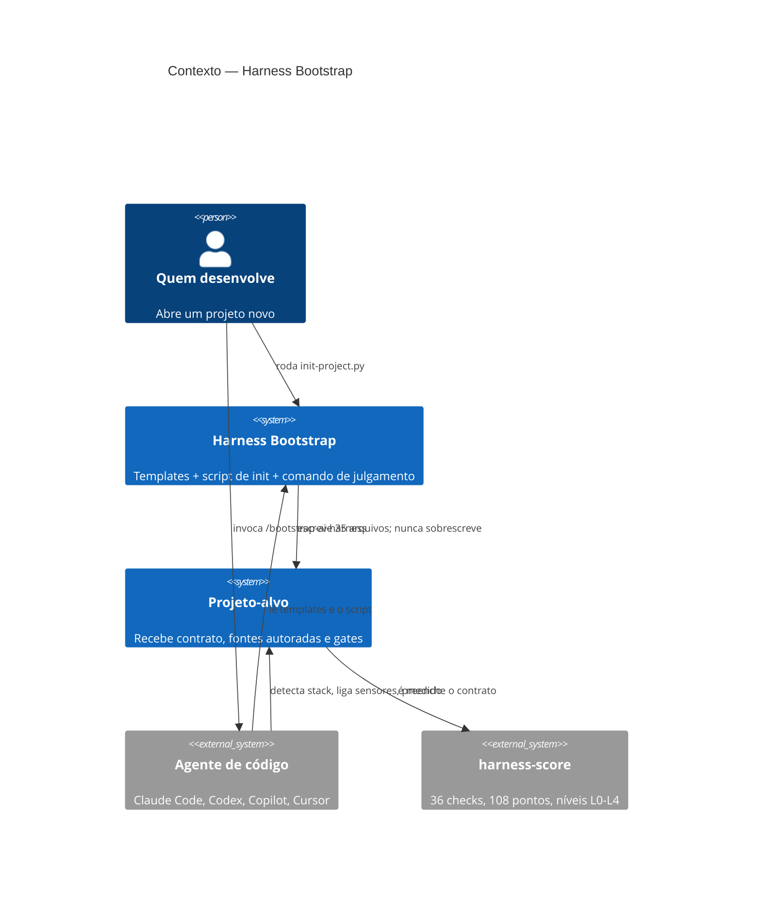

# C4 nível 1 — Contexto

O Harness Bootstrap prepara o *harness* de IA de outros repositórios: o conjunto de
contrato, skills, agentes, regras, hooks e sensores que dirige um agente de código.
Ele não roda em produção e não é dependência de ninguém — é usado uma vez por projeto,
e depois consultado quando um template muda.

## Público e responsabilidade

| Ator | Tipo | Por que interage |
|---|---|---|
| Pessoa que desenvolve | pessoa | roda `init-project.py` ao abrir um projeto novo |
| Agente de código (Claude Code, Codex, Copilot) | sistema | executa `/bootstrap-ai-harness` e depois lê o contrato que foi instalado |
| Projeto-alvo | sistema | recebe os 35 arquivos e passa a ser medido pelo harness-score |
| harness-score | sistema externo | pontua o resultado; 36 checks determinísticos, sem LLM e sem rede |

## Diagrama

## Fora de escopo

- **Rodar em produção.** Nenhum artefato daqui é executado pelo projeto-alvo em runtime,
  exceto `sync-ai-surfaces.py` e os hooks, que são ferramentas de desenvolvimento.
- **Qualidade do que os templates dizem.** O harness-score mede presença e estrutura, não
  acerto: uma regra desatualizada pontua igual a uma fresca.
- **Escolher a stack do projeto-alvo.** Os sensores são neutros de propósito; a stack é
  decisão do projeto.
- **Gerenciar o ciclo de vida depois do bootstrap.** Não há atualização automática de um
  projeto já semeado; um template novo é aplicado com `--check` e decisão humana.

## Ligações

- Containers: [`02-container.md`](02-container.md)
- Decisões que moldam este nível:
  [0001](../decisions/0001-copiar-templates-em-vez-de-gerar.md),
  [0002](../decisions/0002-harness-score-como-metrica.md)
