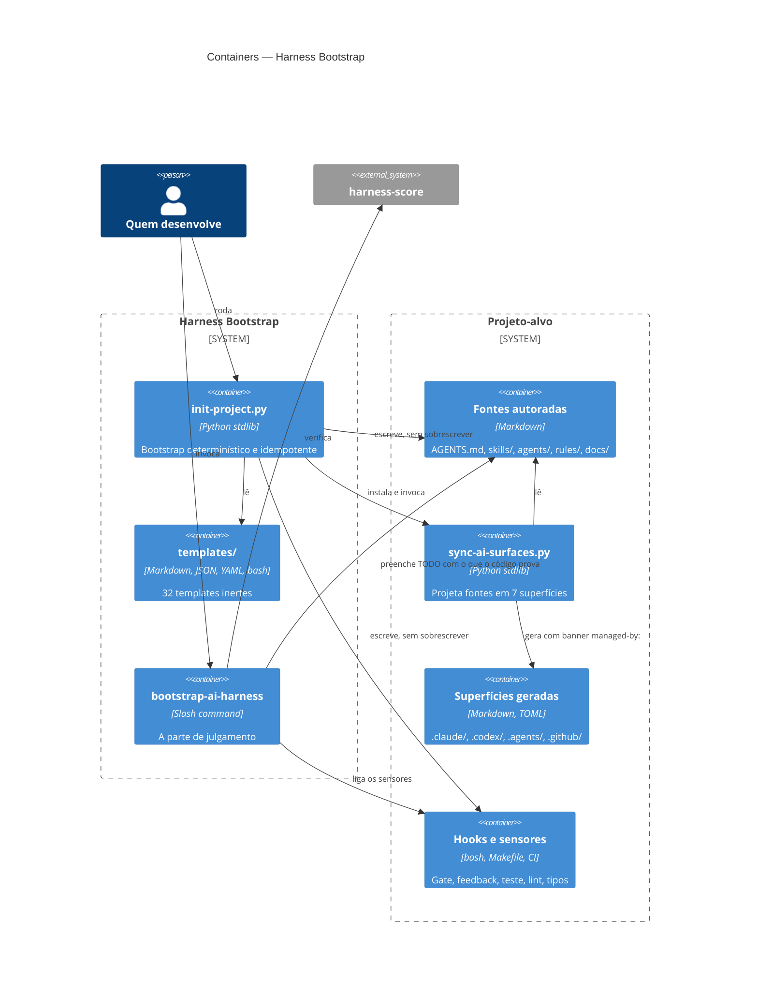

# C4 nível 2 — Containers

Quatro unidades, nenhuma com estado. A divisão segue uma linha só: **o que é
determinístico fica em script, o que exige julgamento fica em prompt.**

## Containers

| Container | Tecnologia | Responsabilidade | Fala com |
|---|---|---|---|
| `scripts/init-project.py` | Python 3.12, stdlib | copia templates, substitui placeholders, semeia um exemplo de cada artefato, monta `docs/` nas duas línguas, invoca o gerador | `templates/`, projeto-alvo, `sync-ai-surfaces.py` |
| `templates/` | Markdown, JSON, YAML, Makefile, bash | 32 arquivos inertes; a extensão `.tpl` evita que um template seja lido como contrato aninhado | lido por `init-project.py` |
| `bootstrap-ai-harness.prompt.md` | prompt de slash command | detecta stack, liga sensores, preenche o contrato, verifica com saída real | agente de código, projeto-alvo |
| `templates/sync-ai-surfaces.py` | Python 3.12, stdlib | instalado no projeto-alvo; projeta fontes autoradas em 7 superfícies e detecta divergência (`--check`) e órfãs (`--prune`) | fontes e superfícies do projeto-alvo |

Nenhum deles depende de rede, de PyYAML ou de qualquer pacote externo. O único ponto de
rede é `npx harness-score`, opcional e só na verificação.

## Diagrama

## Decisões estruturais

- **Sem árvore canônica separada** (`.ai/`): os formatos nativos já são os mais ricos e
  carregam sem indireção. Uma pasta canônica paralela adiciona um salto e uma segunda
  coisa para manter em sincronia.
- **Superfícies geradas são versionadas de propósito**, para que um clone novo funcione
  sem rodar nada. O banner `managed-by:` na linha seguinte ao frontmatter é o que o
  hook de gate usa para barrar edição à mão.
- **Sensores atrás de um `Makefile`**: CI, pre-commit e o hook de `PostToolUse` chamam
  alvos, não ferramentas. Nada downstream conhece a stack.

## Ligações

- Contexto: [`01-context.md`](01-context.md)
- Spec: [`../specs/bootstrap-de-projetos.md`](../specs/bootstrap-de-projetos.md)
- Nível 3 e 4 deliberadamente ausentes — ver [`../../README.md`](../../README.md)
