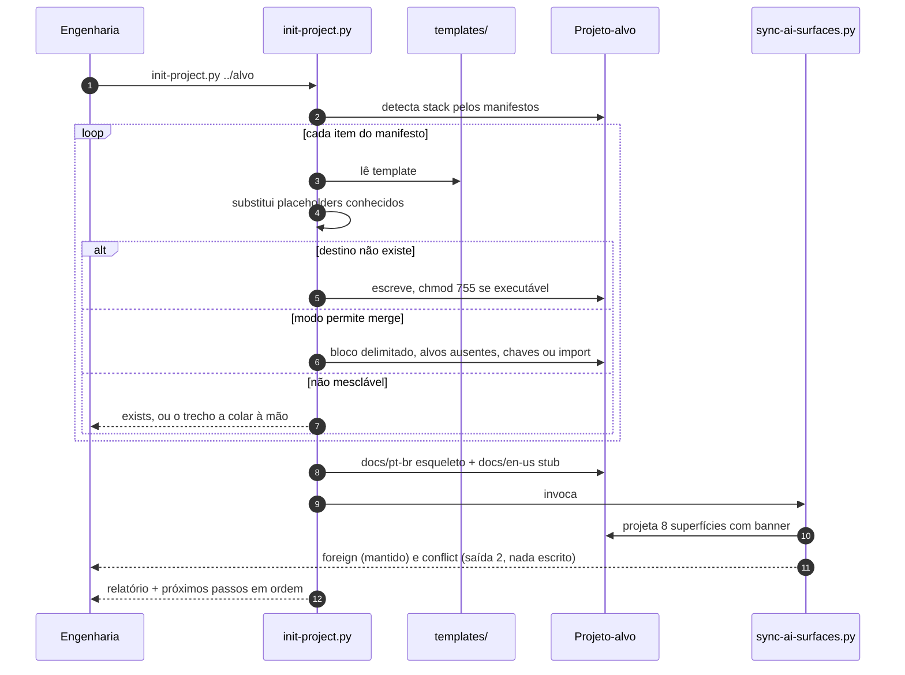

# SDD — Bootstrap de projetos

Preparar o harness de IA de um repositório em um comando, de forma repetível e
auditável.

| Campo | Valor |
|---|---|
| Estado | implementada |
| ADRs que a restringem | [0001](../decisions/0001-copiar-templates-em-vez-de-gerar.md), [0002](../decisions/0002-harness-score-como-metrica.md), [0003](../decisions/0003-merge-por-arquivo-em-projeto-existente.md) |
| Nível C4 afetado | [02-container](../architecture/02-container.md) |

## Problema

Cada projeto novo recomeçava do zero a mesma configuração de IA. O mesmo gerador de
superfícies existia em três repositórios com três md5 diferentes — 194, 254 e 273 linhas,
docstrings em línguas distintas. Um deles versionava `__pycache__`. Ninguém sabia qual
era a versão boa, e nada media o resultado.

Custo: retrabalho por projeto, divergência silenciosa entre projetos, e nenhuma resposta
para "este repositório está bem preparado para agentes?".

## Escopo

Dentro: instalar contrato, adaptadores, fontes autoradas, `docs/` nas duas línguas,
hooks, sensores neutros, CI, pre-commit e higiene; instalar e rodar o gerador de
superfícies; auditar um projeto já semeado. Em projeto que **já existe**, ligar o
harness ao que está lá — mesclando o que pode ser mesclado, e apontando o que não pode.

**Fora**: escolher a stack do alvo; preencher os `TODO:`; atualizar automaticamente um
projeto já semeado quando um template muda; medir qualidade de teste ou acerto de regra.

## Requisitos

| # | Requisito | Tipo | Aceitação |
|---|---|---|---|
| R1 | Nunca sobrescrever, truncar ou apagar conteúdo existente | não-funcional | conteúdo do alvo antes da execução está presente depois, byte a byte |
| R2 | Idempotente | não-funcional | mesma entrada, mesma saída, sem escrita na repetição |
| R3 | Sem rede e sem dependência externa | não-funcional | só stdlib do Python 3.12 |
| R4 | Projeto resultante em L2 no harness-score | funcional | `npx harness-score` reporta `L2 · Guided 83/106` |
| R5 | Caminho até L4 aberto sem tocar nos templates | funcional | preencher 4 alvos do `Makefile` + configs + lockfile leva a `L4 106/106` |
| R6 | `docs/` com paridade entre línguas desde o primeiro commit | funcional | `diff` dos dois `find` volta vazio |
| R7 | Toda pasta sob `docs/` lowercase | funcional | `find docs -type d -name '*[A-Z]*'` volta vazio |
| R8 | Modo auditoria que falha quando o harness não está **ligado** | funcional | `--check` sai 1 e distingue `missing` de `incomplete — needs ...` |
| R9 | Funcionar em projeto que já tem contrato, sensores, hooks e CI próprios | funcional | fixture brownfield: `test:` do projeto preservado, hook próprio preservado, `@AGENTS.md` na linha 1, `harness.yml` ao lado do `ci.yml` |
| R10 | O gerador nunca apaga nem sobrescreve arquivo escrito à mão | não-funcional | sem banner `managed-by:` → `foreign` (mantido) ou `conflict` (saída 2, nada escrito) |

## Projeto

Um manifesto de itens `(template, destino, modo de merge, executável, requisitos)`
percorrido em ordem. O **modo** é o que permite o mesmo comando servir a um diretório
vazio e a um projeto de anos: `whole` não toca no que existe, `block` acrescenta um bloco
delimitado uma vez, `make` acrescenta só os alvos ausentes, `json` mescla chaves com
hooks casados por `command`, `import` garante `@AGENTS.md` na linha 1, `advise` imprime o
trecho sem tocar no arquivo. Os **requisitos** são o que `--check` afere no destino. Placeholders são
substituídos por chave conhecida, um a um — nunca varredura cega de `{{...}}`, porque
`${{ vars.HARNESS_MIN_LEVEL }}` é sintaxe do GitHub Actions e tem de sobreviver.

Os documentos de `docs/` são emitidos duas vezes: o esqueleto real em `pt-br/`, e um stub
com ponteiro em `en-us/`, garantindo R6 sem tradução automática.

## Dados e contratos

- **Placeholders**: `{{PROJECT}}`, `{{YEAR}}`, `{{COPYRIGHT_HOLDER}}`, `{{AGENT_NAME}}`,
  `{{SKILL_NAME}}`, `{{RULE_NAME}}`, `{{CAPABILITY}}`, `{{DECISION_TITLE}}`, `{{TITLE}}`,
  `{{RELATIVE_PATH}}`. Placeholder remanescente é reportado, não silenciado.
- **Banner**: `<!-- managed-by:<repo>/sync-ai-surfaces — do not edit by hand -->`, na
  linha seguinte ao fechamento do frontmatter. Não na linha 1: parser de frontmatter só
  reconhece `---` na primeira linha.
- **Códigos de saída**: `init-project.py` — `0` sucesso, `1` em `--check` com pendência.
  `sync-ai-surfaces.py` — `0` sucesso, `1` em `--check` com deriva, `2` colisão com
  arquivo escrito à mão (nada é escrito).
- **Marcador de bloco**: `# harness-bootstrap >>>` … `# harness-bootstrap <<<`. Presente
  também na criação: sem ele a segunda execução acrescentaria o que a primeira escreveu.

## Alternativas consideradas

| Alternativa | Por que não |
|---|---|
| Prompt gerando tudo do zero (desenho anterior) | produziu três implementações divergentes do mesmo contrato |
| Copiar com `cp -r` e um `sed` | não semeia exemplos, não monta as duas línguas, não é auditável, quebra o `${{ }}` do Actions |
| Template de repositório do GitHub | não funciona em repositório já existente, e não tem modo auditoria |
| `cookiecutter` / `copier` | dependência externa e uma linguagem de template a mais para manter; o manifesto aqui tem 36 entradas, não justifica |

## Plano de teste

Automatizado em `tests/` (32 casos, stdlib, `make test`), com estas âncoras de saída
real:

- projeto novo → `36 written or merged`, 44 arquivos no total após o gerador;
- terceira execução → árvore idêntica à da primeira, nos dois cenários;
- projeto existente → `test:` continua rodando o recipe do projeto, hook próprio
  preservado ao lado dos três gates, `.gitignore` ganha `.env` e `*.pem`, `harness.yml`
  ao lado do `ci.yml`, `.pre-commit-config.yaml` intocado com o trecho impresso;
- auditoria honesta → `settings.json` sem a chave `hooks` faz `--check` sair 1 apontando
  `gate-write.sh`;
- posse do gerador → skill à mão sobrevive a `--prune`; órfão com banner é podado;
  colisão sai 2 sem escrever; asset companheiro continua sincronizando;
- `--dry-run` → não escreve, na instalação e na remoção;
- remoção → projeto novo volta a diretório vazio; projeto que já existia volta com
  cada arquivo seu byte a byte igual, e o JSON igual no dado;
- remoção → arquivo editado depois do bootstrap fica, skill à mão sob caminho gerado
  fica, `--force` leva os dois;
- paridade `pt-br`/`en-us` → `diff` vazio;
- `find docs -type d -name '*[A-Z]*'` → vazio;
- `make sync-check` → `8 generated file(s) up to date`;
- `npx harness-score` → `L2 · Guided 83/106`;
- com sensores e lockfile preenchidos → `L4 · Self-correcting 106/106`;
- gate de escrita: 4 casos (barra superfície gerada, passa a fonte autorada, passa
  `AGENTS.md` que só menciona o banner em prosa);
- gate de bash: 14 casos, 8 bloqueios e 6 passagens.

## Questões abertas

- [ ] Como propagar mudança de template para projetos já semeados? Hoje é `--check` mais
      decisão humana.
- [ ] Vale um `--adopt` que mova skills e agentes artesanais de `.claude/` para as fontes
      autoradas? Hoje é `git mv` documentado no manual.
- [ ] Vale um `--stack python|node|go` que já escreva os configs de sensor, em vez de
      deixar tudo neutro?
